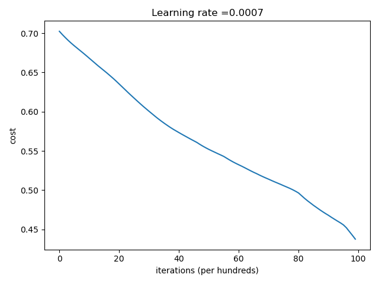
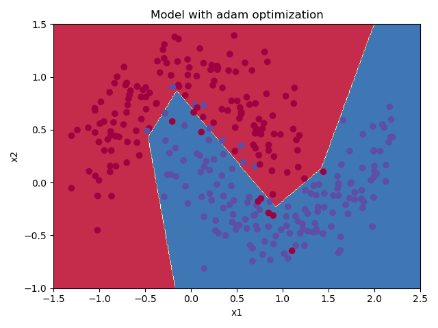

## Optimization Algorithms Comparison - deeplearning.ai, Week2

run  
python Runner.py  
to generate all the graphs 

#### Dataset - sklearn moons  

  

#### Mini-Batch Gradient Descent

###### Learning Curve

  

###### Decision Boundary

  

###### Accuracy: 0.797

#### Momentum

###### Learning Curve

  

###### Decision Boundary

  

###### Accuracy: 0.797

#### ADAM

###### Learning Curve

  

###### Decision Boundary

  

###### Accuracy: 0.94

